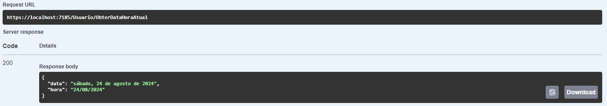
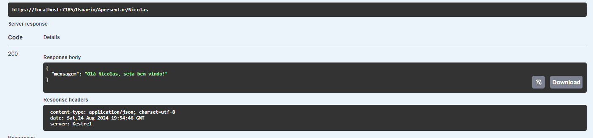

# Introdução à API com .NET

Este projeto faz parte de um curso introdutório à criação de APIs utilizando .NET. O objetivo é ensinar os conceitos básicos de APIs, criando métodos GET simples.

## Funcionalidades da API

- **GET /data**: Retorna a data e hora atual do servidor.
- **GET /usuario/{nome}**: Retorna uma saudação personalizada com o nome fornecido pelo usuário.

## Estrutura do Projeto

O projeto é organizado da seguinte maneira:

- **Controllers**: Contém os controladores responsáveis por lidar com as requisições HTTP.
  - `DataController.cs`: Controlador que gerencia a rota `/data`.
  - `UsuarioController.cs`: Controlador que gerencia a rota `/usuario/{nome}`.
- **Program.cs**: Arquivo principal onde a aplicação é configurada e iniciada.

## Como Executar

1. Clone este repositório.
2. Abra o projeto em uma IDE compatível com .NET (Visual Studio, Visual Studio Code, etc.).
3. Compile e execute o projeto.
4. Utilize um cliente HTTP como Postman ou o navegador para testar as rotas GET descritas acima.

## Exemplos de Requisição

- **Obter Data Atual**
- 
  ```
  GET /data
  {
    "data": "2024-08-24T12:34:56"
  }
  ```

  

  ```
  GET /usuario/Joao
  {
    "mensagem": "Olá, Joao!"
  }
    ```
  


